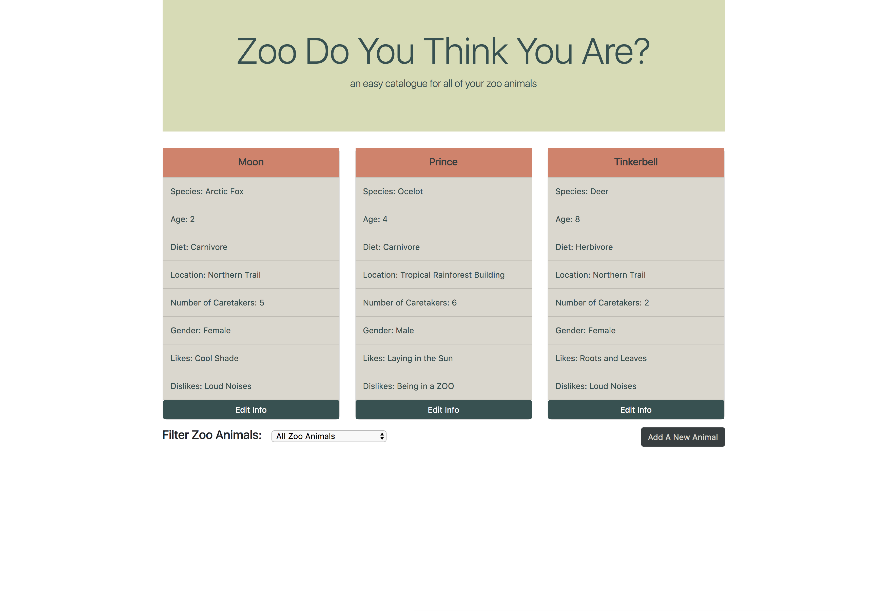

# Friday - Zoo
### Lew Davidson

## Description
 * A zoo app that allows a user (employee of a zoo) to log, display, edit, and filter a list of animals in their care using angular.

 

## Setup Instructions
 * Open Terminal
 * $ cd Desktop
 * $ git clone https://github.com/lewdavidson/angular-friday.git
 * $ cd friday
 * $ npm install
 * $ ng serve -o (- to view and use app)
 * open http://localhost:4200/ in the web browser of your choice.

## Requirements:

- [ x ] Users can view a list of currently logged animals.
- [ x ] Users can edit animal's name, age, and # of needed caretakers.
- [ x ] Users can add new animals via a form including:
  - [ x ] Name
  - [ x ] Species
  - [ x ] Age
  - [ x ] Diet
  - [ x ] Zoo Location
  - [ x ] Number of needed caretakers
  - [ x ] Gender
  - [ x ] One Like
  - [ x ] One Dislike
- [ x ] Users can filter the list of available animals by:
 - [ x ] All
 - [ x ] Animals less than 2 years old
 - [ x ] Animals more than 2 years old

Must use:
 - [ x ] Model
 - [ x ] Portfolio ready
 - [ x ] Separate components for adding, editing, and displaying
 - [ x ] Successfully create, edit, and display instances of a model
 - [ x ] Typescript used
 - [ x ] Filter instances with a pipe.

This project was generated with [Angular CLI](https://github.com/angular/angular-cli) version 1.6.5.
